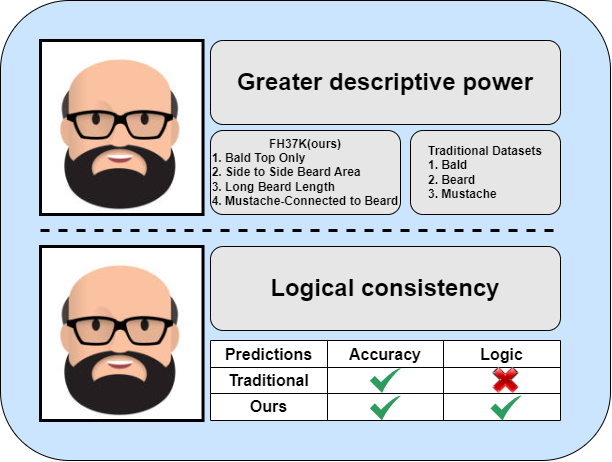

# Logical-Consistency-and-Greater-Descriptive-Power-for-Facial-Hair-Attribute-Learning
## Paper accepted to the IEEE Conference on Computer Vision and Pattern Recognition (CVPR) 2023

<figure>
  
  <figcaption>Figure 1: We provide richer descriptions on facial hair that covers Beard Area, Beard Length, Mustache, Sideburns, and Bald. We first consider the logical consistency of the predictions for multi-label classification task.</figcaption>
</figure>

## TL;DR
This repository provides a facial hair dataset, FH37K, which describes the facial hair in Area, Length, Connectedness dimensions. In addition, a method that can force the model to make predictions logical. See details below.

## Table of contents

<!--ts-->
- [Paper details](#paper-details)
  * [Abstract](#abstract)
  * [Citation](#citation)
- [Installation](#installation)
- [Training](#training)
  * [Prepare FH37K dataset](#prepare-fh37k-dataset)
  * [Train](#train)
- [Testing](#testing)
  * [Accuracy](#Accuracy)
  * [Logical Consistency](#logical-consistency)
<!--te-->

## Paper details
Haiyu Wu, Grace Bezold, Aman Bhatta, [Kevin W. Bowyer](https://www3.nd.edu/~kwb/), "*Logical Consistency and Greater Descriptive Power for Facial Hair Attribute Learning*", CVPR, 2023, [arXiv:2302.11102](https://arxiv.org/abs/2302.11102)

### Abstract
> Face attribute research has so far used only simple binary attributes for facial hair; e.g., beard / no beard. We have created a new, more descriptive facial hair annotation scheme and applied it to create a new facial hair attribute dataset, FH37K. Face attribute research also so far has not dealt with logical consistency and completeness. For example, in prior research, an image might be classified as both having no beard and also having a goatee (a type of beard). We show that the test accuracy of previous classification methods on facial hair attribute classification drops significantly if logical consistency of classifications is enforced. We propose a logically consistent prediction loss, LCPLoss, to aid learning of logical consistency across attributes, and also a label compensation training strategy to eliminate the problem of no positive prediction across a set of related attributes. Using an attribute classifier trained on FH37K, we investigate how facial hair affects face recognition accuracy, including variation across demographics. Results show that similarity and difference in facial hairstyle have important effects on the impostor and genuine score distributions in face recognition.

### Citation
If you use any part of our code or data, please cite our paper.
```
@article{wu2023logical,
  title={Logical Consistency and Greater Descriptive Power for Facial Hair Attribute Learning},
  author={Wu, Haiyu and Bezold, Grace and Bhatta, Aman and Bowyer, Kevin W},
  journal={arXiv preprint arXiv:2302.11102},
  year={2023}
}
```

## Installation
 

Install dependecies with Python 3.
```
pip install -r requirements.txt
```

## Training
### Prepare FH37K dataset
Since we have not gotten the permission to distribute the images from the original image sources, 
you need to download the dataset from [CelebA](http://mmlab.ie.cuhk.edu.hk/projects/CelebA.html)
and [WebFace260M](https://www.face-benchmark.org/) (only the first 30000 identities in subfolder 0 needed). For
your convenience, you can collect FH37 by running
```
python fh37k_collection.py \
-web00 /path/to/webface00/folder \
-celeba /path/to/celeba/folder \
-pf ./FH37K/label_partition.csv \
-lf ./FH37K/facial_hair_annotations.csv
```
After you have the FH37K dataset, using the [image2lmdb.py](./utils/image2lmdb.py) to generate a LMDB dataset (train and val).
```
python utils/image2lmdb.py \
-im ./FH37K/train \
-l ./FH37K/facial_hair_annotations.csv \
-t train \
-d fh37k_lmdb_dataset
```
### Train
Once the LMDB train/val file are ready, simply run the following script to start training
```
python -u train_with_lmdb.py \
-td ./fh37k_lmdb_dataset/train.lmdb \
-vd ./fh37k_lmdb_dataset/val.lmdb \
-sr ./model_weights/ \
-m resnet50 \
-lf ./model_weights/resnet50_loss.npy \
-bs 256 \
-lr 1e-3 \
-e 50 \
-a 24 \
-l 0.5 \
-pt
```
## Testing
To evaluate with the pretrained model, download the model from [Model Zoo](https://drive.google.com/drive/folders/1ttUaN3kOHJ9GYLz0nQd19hDOIm9AHeTO?usp=sharing),
and put models to ./weights. 

| models    |  Overall    |   Negative   |  Positive |
| ---- | ---- | ---- | ---- |
| ResNet50     |   89.89   |  92.65    |  70.23  |
| SE-ResNeXt     |  89.71    |   92.31   | 71.33   |

This project evaluate the model in two aspects - ***Accuracy*** and ***Logical consistency***.

### Accuracy
To evaluate the accuracy on test set, simply edit the bash script [image_folder_test.sh](image_folder_test.sh) and run
```
bash image_folder_test.sh
```
### Logical Consistency
To evaluate the logical consistency in the real-world simulation,
first run [file_path_extractor.py](./file_path_extractor.py) to collect the image paths of
the first 30,000 (0_0_0000000 to 0_0_0029999) identities in WebFace260M
``` 
python file_path_extractor.py -s /path/to/webface00/folder -d . -end_with jpg
```
The next step is dropping the images that are in the FH37K dataset. 
``` 
python Scripts/remove_duplicates.py -i raw/image/path/file
```

Once the image paths have been collected in a .txt file and the duplicate image paths are dropped, 
edit the [image_file_test.sh](./image_file_test.sh) and run the bash script to save the predictions
``` 
bash image_file_test.sh
```
After getting the predictions, calculating the fail rate with the logical consistency checked
``` 
python Scripts/check_impossible_ratio.py -bt /your/prediction/file
```